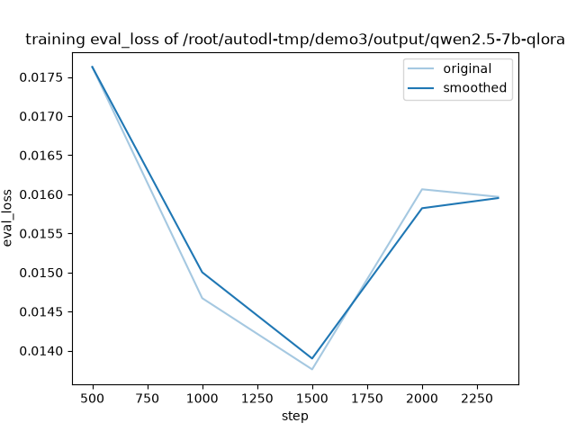

# Demo3: Qwen2.5-7B 指令微调用于生物医学命名实体识别（NER）

基于 Qwen2.5-7B-Instruct，使用 QLoRA 在 BC2GM 数据集上做指令微调，完成生物医学基因实体（GENE）识别任务，并对比 **LoRA rank**、**学习率**、**量化方式** 对性能与显存的影响。

---

## 目录

- [任务简介](#任务简介)
- [数据集](#数据集)
- [方法](#方法)
- [训练配置](#训练配置)
- [评测方法](#评测方法)
- [主要结果](#主要结果)
- [参数调优趋势](#参数调优趋势)
- [结论](#结论)
- [快速开始](#快速开始)
- [项目结构](#项目结构)
- [可视化](#可视化)
- [参考](#参考)

---

## 任务简介

- **任务**：生物医学命名实体识别（NER），识别句子中的基因/蛋白实体（GENE）
- **形式**：指令微调，生成式输出，把实体用 `<gene>...</gene>` 包裹
- **基座模型**：Qwen2.5-7B-Instruct
- **微调方法**：QLoRA（4-bit bnb 量化）+ LoRA（rank 16, target all）

---

## 数据集

- **来源**：[BC2GM](https://biocreative.bioinformatics.udel.edu/)（BioCreative II Gene Mention）
- **规模**：

| Split | 样本数 |
|-------|--------|
| train | 12,500 |
| dev   | 2,500  |
| test  | 5,000  |

- **格式**：每条样本包含 `instruction` / `input` / `output` 三个字段

```json
{
  "instruction": "You are a biomedical named entity recognition system. Identify all GENE entities in the given sentence and wrap each one with <gene> and </gene> tags. Only output the tagged sentence, nothing else.",
  "input": "Phenotypic analysis demonstrates that trio and Abl cooperate in regulating axon outgrowth in the embryonic central nervous system ( CNS ) .",
  "output": "Phenotypic analysis demonstrates that <gene>trio</gene> and <gene>Abl</gene> cooperate in regulating axon outgrowth in the embryonic central nervous system ( CNS ) ."
}
```

---

## 方法

- **基座**：Qwen2.5-7B-Instruct
- **量化**：4-bit（bitsandbytes NF4）
- **微调**：LoRA，`lora_rank=16`，`lora_alpha=32`，`lora_target=all`
- **训练框架**：LLaMA-Factory
- **可视化**：SwanLab

---

## 训练配置

| 项 | 值 |
|---|---|
| 基座 | Qwen2.5-7B-Instruct |
| 微调方法 | QLoRA（4-bit bnb）+ LoRA |
| lora_rank | 16（baseline） |
| lora_alpha | 32 |
| lora_target | all（q/k/v/o/gate/up/down_proj） |
| per_device_train_batch_size | 4 |
| gradient_accumulation_steps | 4 |
| 等效 batch size | 16 |
| learning_rate | 5e-5 |
| num_train_epochs | 3 |
| cutoff_len | 1024 |
| lr_scheduler_type | cosine |
| warmup_ratio | 0.1 |
| bf16 | true |
| gradient_checkpointing | true |
| 硬件 | RTX 5090 32G |
| 训练时长 | ~50 分钟 |
| train_loss | 0.0179 |
| eval_loss | 0.0160 |

---

## 评测方法

模型输出为 `<gene>...</gene>` 包裹的句子，评测流程：

1. 用正则 `<gene>(.*?)</gene>` 抽取预测实体 span
2. 统一小写 + strip 归一
3. 与 gold 实体做集合匹配，计算 TP / FP / FN
4. Entity-level 指标：
   - `Precision = TP / (TP + FP)`
   - `Recall = TP / (TP + FN)`
   - `F1 = 2PR / (P + R)`

同时提供两套口径（唯一实体 / 按出现次数），结果一致（baseline F1 均为 0.8427）。

---

## 主要结果

### Baseline（rank16 / lr5e-5 / QLoRA）

| 指标 | 值 |
|---|---|
| Precision | 0.8470 |
| Recall | 0.8386 |
| **F1** | **0.8427** |
| 训练显存 | 25.9 GB |
| 训练时长 | ~50 分钟 |

### 参数调优实验汇总

| 实验 | rank | lr | 量化 | Precision | Recall | F1 | 训练显存 |
|------|------|-----|------|-----------|--------|-----|----------|
| baseline | 16 | 5e-5 | 4-bit | 0.8470 | 0.8386 | **0.8427** | 25.9G |
| rank8 | 8 | 5e-5 | 4-bit | 0.8433 | 0.8359 | **0.8395** | 25.9G |
| rank32 | 32 | 5e-5 | 4-bit | 0.8526 | 0.8421 | **0.8473** | 29.1G |
| lr1e5 | 16 | 1e-5 | 4-bit | 0.7950 | 0.7900 | **0.7925** | 25.9G |
| lr1e4 | 16 | 1e-4 | 4-bit | 0.8524 | 0.8458 | **0.8491** | 25.9G |
| lora（不量化） | 16 | 5e-5 | none | 0.8468 | 0.8419 | **0.8443** | 27.8G |

> 注：**显存指训练阶段稳定占用**。所有 QLoRA 实验的推理阶段显存稳定在 ~16.2 GB，与 rank / learning rate 无关。

### 与参考指标对比

| 配置 | 参考 F1 | 本实验 F1 |
|------|---------|-----------|
| Qwen2.5-7B-lora | 84% | **84.43%**（全精度 LoRA） |
| Qwen2.5-7B-qlora | 83% | **84.27%**（QLoRA baseline） |

本实验 QLoRA baseline 略高于参考 83%，全精度 LoRA 与参考 84% 持平。

---

## 参数调优趋势

### 1. LoRA rank 对 F1 的影响

| rank | F1 |
|------|-----|
| 8 | 0.8395 |
| 16 | 0.8427 |
| 32 | 0.8473 |

**趋势**：F1 随 rank 单调上升，8 → 16 涨 0.32，16 → 32 涨 0.46，说明 rank=16 时模型尚未饱和。


### 2. 学习率对 F1 的影响

| lr | F1 |
|-----|-----|
| 1e-5 | 0.7925 |
| 5e-5 | 0.8427 |
| 1e-4 | 0.8491 |

**趋势**：F1 随学习率单调上升。lr=1e-5 相比 5e-5 掉 5 个点，说明在固定 3 epoch 下学习率过小会导致严重欠拟合。


### 3. 量化方式对 F1 与显存的影响

| 配置 | F1 | 训练显存 |
|------|-----|----------|
| QLoRA（4-bit，rank16） | 0.8427 | 25.9G |
| LoRA（全精度，rank16） | 0.8443 | 27.8G |

**趋势**：QLoRA 相比全精度 LoRA 节省约 1.9G 显存（-6.8%），F1 仅相差 0.16，量化性价比高。


### 训练 loss 曲线




---

## 结论

1. **学习率对性能影响最大**：lr=1e-5 相比 5e-5 掉 5.02 个点，在固定 3 epoch 下学习率过小会严重欠拟合；lr=1e-4 表现最优（0.8491）。

2. **LoRA rank 收益尚未饱和**：rank 从 8 → 16 → 32，F1 单调上升（0.8395 → 0.8427 → 0.8473），未观察到收益递减。

3. **显存对 rank 非线性**：rank 8 ≈ rank 16（均 25.9G），rank 32 涨到 29.1G。原因是 rank ≤ 16 时显存瓶颈在激活值，rank = 32 时 LoRA 参数与优化器状态开始显著占用显存。

4. **QLoRA 性价比高**：相比全精度 LoRA，QLoRA 省 1.9G 显存（-6.8%），F1 仅低 0.16，适合显存受限场景。

5. **学习率不影响显存**：lr 1e-5 / 5e-5 / 1e-4 三个实验训练显存完全一致（25.9G）。

### 最优配置建议

- **性能优先**：rank=32 + lr=1e-4（未组合验证，预期 > 85%）
- **显存优先**：rank=16 + lr=1e-4 + QLoRA（F1 0.8491，显存 25.9G）

---

## 快速开始

### 环境

```bash
conda create -n demo3 python=3.11 -y
conda activate demo3
pip install -r requirements.txt
```

### 数据准备

BC2GM 原始数据从官方下载后，运行：

```bash
python data/build_dataset.py --input /path/to/bc2gm --output data/
```

生成 `data/bc2gm_train.json` / `data/bc2gm_dev.json` / `data/bc2gm_test.json`。

### 训练

```bash
llamafactory-cli train configs/train_qlora.yaml
```

### 推理 + 评测

```bash
# 1. 在 test 集上生成预测
llamafactory-cli train configs/predict_qlora.yaml

# 2. 计算 entity-level F1
python scripts/eval_f1.py \
  --pred results/predict/generated_predictions.jsonl \
  --gold data/bc2gm_test.json
```

### 批量参数实验

```bash
bash scripts/run_all.sh
```

自动跑 rank / lr / 量化共 5 组实验，结果写入 `results/results.csv`，并生成趋势图。

---

## 项目结构

```
demo3-ner-qlora/
├── README.md
├── requirements.txt
├── data/
│   └── build_dataset.py
├── configs/
│   ├── train_qlora.yaml
│   └── predict_qlora.yaml
├── scripts/
│   ├── eval_f1.py
│   ├── run_one.sh
│   ├── run_all.sh
│   └── plot.py
└── results/
    ├── results.csv
    ├── fig_rank_f1.png
    ├── fig_lr_f1.png
    ├── fig_quant_compare.png
    ├── training_loss.png
    └── training_eval_loss.png
```

---

## 可视化

SwanLab 项目：[qwen2.5-ner](https://swanlab.cn/@Lyx1/qwen2.5-ner)

包含 6 个 run：

- `bc2gm-qlora`（baseline）
- `exp_rank8`
- `exp_rank32`
- `exp_lr1e5`
- `exp_lr1e4`
- `exp_lora`

---

## 参考

- [LLaMA-Factory](https://github.com/hiyouga/LLaMA-Factory)
- [BC2GM Dataset](https://biocreative.bioinformatics.udel.edu/)
- [Qwen2.5](https://github.com/QwenLM/Qwen2.5)
- [SwanLab](https://swanlab.cn/)