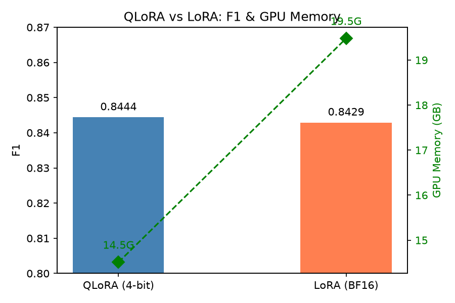

# Demo 3：基于 Qwen2.5-7B 的指令微调实体识别（NER）

基于 Qwen2.5-7B-Instruct，在 BC2GM 生物医学数据集上完成基因实体（GENE）识别任务，对比 **LoRA** 与 **QLoRA** 两种微调方案，并分析 **LoRA rank**、**学习率** 对性能与显存的影响。

---

## 一、任务目标

- **任务**：生物医学命名实体识别（NER），识别句子中的基因/蛋白实体
- **基座模型**：Qwen2.5-7B-Instruct
- **数据集**：BC2GM（BioCreative II Gene Mention）
- **微调方式**：指令微调，生成式输出，实体用 `<gene>...</gene>` 包裹
- **评测指标**：Entity-level Precision / Recall / F1

---

## 二、数据集

- **来源**：[BC2GM](https://biocreative.bioinformatics.udel.edu/)（BioCreative II Gene Mention）
- **规模**：

| Split | 样本数 |
|-------|--------|
| train | 12,500 |
| dev   | 2,500  |
| test  | 5,000  |

- **格式**：每条样本包含 `instruction` / `input` / `output`

```json
{
  "instruction": "You are a biomedical named entity recognition system. Identify all GENE entities in the given sentence and wrap each one with <gene> and </gene> tags. Only output the tagged sentence, nothing else.",
  "input": "Phenotypic analysis demonstrates that trio and Abl cooperate in regulating axon outgrowth in the embryonic central nervous system ( CNS ) .",
  "output": "Phenotypic analysis demonstrates that <gene>trio</gene> and <gene>Abl</gene> cooperate in regulating axon outgrowth in the embryonic central nervous system ( CNS ) ."
}
```

---

## 三、方法

### 3.1 模型与微调

- **基座**：Qwen2.5-7B-Instruct
- **量化**：4-bit NF4（QLoRA）
- **LoRA**：`rank=16`，`alpha=32`，`dropout=0.05`
- **target_modules**：`q_proj, k_proj, v_proj, o_proj, gate_proj, up_proj, down_proj`

### 3.2 训练流程

| 模块 | 文件 | 说明 |
|------|------|------|
| 统一入口 | `main.py` | 训练、评估与推理命令 |
| 数据预处理 | `dataset.py` | bc2gm → instruction 格式，构造 prompt/label，动态 padding |
| 模型设计 | `model.py` | 加载 Qwen2.5-7B + 4-bit 量化 + 注入 LoRA |
| 训练 | `trainer.py` | 自定义训练循环 + cosine 调度 + 梯度累积 + SwanLab 记录 |
| 评估 | `metrics.py` | 解析 `<gene>` 标签，entity-level P/R/F1 |
| 推理 | `predict.py` | 批量生成 + 交互式单句 NER |
| 通用工具 | `utils.py` | 配置读取、项目路径与随机种子 |
| 可视化 | `plot.py` | 训练曲线与实验趋势图绘制 |

### 3.3 训练配置

| 项 | LoRA (BF16) | QLoRA (4-bit) |
|---|---|---|
| 基座 | Qwen2.5-7B-Instruct | Qwen2.5-7B-Instruct |
| 量化 | 无 | 4-bit NF4 |
| lora_rank | 16 | 16 |
| lora_alpha | 32 | 32 |
| lora_dropout | 0.05 | 0.05 |
| target_modules | q/k/v/o/gate/up/down | q/k/v/o/gate/up/down |
| per_device_train_batch_size | 4 | 4 |
| gradient_accumulation_steps | 4 | 4 |
| learning_rate | 5e-5 | 5e-5 |
| num_train_epochs | 3 | 3 |
| cutoff_len | 1024 | 1024 |
| lr_scheduler_type | cosine | cosine |
| warmup_ratio | 0.1 | 0.1 |
| bf16 | true | true |
| gradient_checkpointing | true | true |
| seed | 42 | 42 |
| 硬件 | RTX 5090 32G | RTX 5090 32G |
| 训练显存 | 19.95 GB（OOM 降级后） | **14.51 GB** |
| 训练稳定性 | Epoch 1 OOM | 全程稳定 |

---

## 四、模型评估

模型输出为 `<gene>...</gene>` 包裹的句子，评测流程：

1. 用正则 `<gene>(.*?)</gene>` 抽取预测实体 span
2. 统一小写 + strip 归一
3. 与 gold 实体做集合匹配，计算 TP / FP / FN
4. Entity-level 指标：

```
Precision = TP / (TP + FP)
Recall    = TP / (TP + FN)
F1        = 2PR / (P + R)
```

---

## 五、实验结果

### 5.1 LoRA vs QLoRA

相同基座、相同 LoRA 配置（rank16 / all target）、相同 lr（5e-5）、相同 epoch（3）、等效 batch 16，只改变**是否 4-bit 量化**及 **batch 配置**：

| 方案 | batch | grad_accum | Precision | Recall | F1 | 训练显存 | 稳定性 |
|------|-------|------------|-----------|--------|-----|----------|--------|
| LoRA | 2 | 8 | 0.8433 | 0.8424 | **0.8429** | 19.48 GB | 稳定 |
| LoRA | 4 | 4 | 0.8385 | 0.8313 | **0.8349** | 19.95 GB | Epoch 1 OOM，自动降级 |
| **QLoRA** | 4 | 4 | 0.8438 | 0.8450 | **0.8444** | **14.51 GB** | 稳定 |

**结论**：

- **QLoRA batch 4 稳定运行**，显存 14.51G，F1 0.8444。
- **全精度 LoRA batch 4 出现 OOM**，PyTorch 自动降级后完成训练，显存 19.95G，F1 掉到 0.8349（比 batch 2 低 0.8 个点）。
- **全精度 LoRA batch 2 稳定**，显存 19.48G，F1 0.8429。
- QLoRA 相比 LoRA batch 2 **省 4.97G 显存（-25.5%）**，F1 高 0.15；相比 LoRA batch 4 **省 5.44G 显存（-27.3%）**，F1 高 0.95。
- **QLoRA 在同等 batch（4）下显存更低、训练更稳、F1 更高**，是消费级显卡上 batch 4 训练的可行方案。



### 5.2 与参考指标对比

| 配置 | 参考指标 | 本实验 |
|------|---------|--------|
| Qwen2.5-7B-LoRA (batch 4) | 显存 27G，F1 84% | batch 4 OOM，降级后 19.95G；batch 2 稳定版 F1 **84.29%** |
| Qwen2.5-7B-QLoRA (batch 4) | 显存 12G，F1 83% | 显存 **14.51G**，F1 **84.44%** |

QLoRA 的 F1 高于参考值 1.4 个点；LoRA batch 4 在 5090 32G 上出现 OOM，需降 batch 到 2 才能稳定训练。

---

## 六、参数调优

在 QLoRA 方案下，对 **LoRA rank** 和 **学习率** 做参数搜索。

### 6.1 实验汇总

| 实验 | rank | lr | 量化 | Precision | Recall | F1 | 训练显存 | 稳定性 |
|------|------|-----|------|-----------|--------|-----|----------|--------|
| baseline | 16 | 5e-5 | 4-bit | 0.8438 | 0.8450 | **0.8444** | 14.51G | 稳定 |
| rank8 | 8 | 5e-5 | 4-bit | 0.8441 | 0.8431 | **0.8436** | 14.28G | 稳定 |
| rank32 | 32 | 5e-5 | 4-bit | 0.8474 | 0.8434 | **0.8454** | 15.28G | 稳定 |
| lr1e5 | 16 | 1e-5 | 4-bit | 0.8026 | 0.8018 | **0.8022** | 14.51G | 稳定 |
| lr1e4 | 16 | 1e-4 | 4-bit | 0.8475 | 0.8389 | **0.8432** | 14.51G | 稳定 |
| lora | 16 | 5e-5 | BF16 | 0.8385 | 0.8313 | **0.8349** | 19.95G | Epoch 1 OOM |

### 6.2 LoRA rank 对 F1 的影响（QLoRA）

| rank | F1 |
|------|-----|
| 8 | 0.8436 |
| 16 | 0.8444 |
| 32 | 0.8454 |

**趋势**：F1 随 rank 单调上升，但**边际收益递减**——8→16 涨 0.08，16→32 涨 0.10，整体差异 < 0.2 个点。

**显存趋势**：rank 8/16 ≈ 14.5G，rank 32 涨到 15.28G。


### 6.3 学习率对 F1 的影响（QLoRA）

| lr | F1 |
|-----|-----|
| 1e-5 | 0.8022 |
| 5e-5 | 0.8444 |
| 1e-4 | 0.8432 |

**趋势**：呈**倒 U 型**，峰值在 **5e-5**。

- lr=1e-5 相比 5e-5 掉 **4.22 个点**，说明在固定 3 epoch 下学习率过小会严重欠拟合
- lr=1e-4 与 5e-5 接近（差 0.12），5e-5 ~ 1e-4 是合理区间

**显存趋势**：三个实验训练显存完全一致（14.51G），证实学习率不影响显存。


---

## 七、结论

1. **QLoRA 在 batch 4 下显著优于全精度 LoRA**：QLoRA batch 4 稳定运行（14.51G，F1 0.8444），全精度 LoRA batch 4 出现 OOM（19.95G，F1 0.8349）。QLoRA 显存少 **5.44G（-27.3%）**，F1 高 **0.95**。

2. **全精度 LoRA 在 5090 32G 上难以稳定支撑 batch 4**：Epoch 1 出现 OOM，PyTorch 自动降级后训练完成，但 F1 掉到 0.8349（比 batch 2 低 0.8 个点）。batch 2 稳定版显存 19.48G，F1 0.8429。**QLoRA 是消费级显卡上 batch 4 训练的可行方案。**

3. **学习率是性能最敏感的变量**：lr=1e-5 相比 5e-5 掉 4.22 个点，**最优 lr ≈ 5e-5 ~ 1e-4**。

4. **LoRA rank 收益边际递减**：rank 8→16→32，F1 从 0.8436 → 0.8444 → 0.8454，整体差异 < 0.2 个点，**rank=16 已基本够用**。

5. **显存对 rank 非线性**：rank 8 ≈ rank 16（均 ~14.5G），rank 32 涨到 15.28G。

6. **学习率不影响显存**：lr 1e-5 / 5e-5 / 1e-4 三个实验显存一致（14.51G）。

### 最优配置

| 优先级 | 配置 | F1 | 显存 |
|--------|------|-----|------|
| 性能优先 | QLoRA + rank32 + lr5e-5 | 0.8454 | 15.28G |
| **综合推荐** | QLoRA + rank16 + lr5e-5 | 0.8444 | 14.51G |
| 显存优先 | QLoRA + rank8 + lr5e-5 | 0.8436 | 14.28G |

---

## 八、项目结构

```
demo3/
├── README.md
├── requirements.txt
├── configs/
│   ├── qlora.json              # QLoRA 训练配置
│   ├── lora.json               # LoRA (BF16) 训练配置
│   └── predict.json            # 推理配置
├── data/
│   └── build_dataset.py        # bc2gm → instruction 格式转换
├── main.py                     # 训练/评估/推理统一入口
├── run_all.py                  # 6 组批量实验
├── model.py                    # 模型加载 + LoRA 注入
├── dataset.py                  # 数据集 + 动态 padding
├── trainer.py                  # 训练循环 + SwanLab 记录
├── predict.py                  # 批量/交互式推理
├── metrics.py                  # 两种口径的 P/R/F1
├── utils.py                    # 配置、路径与随机种子
├── plot.py                     # 训练曲线与实验趋势图
└── results/
    ├── results.csv             # 6 个实验汇总
    ├── fig_rank_f1.png
    ├── fig_lr_f1.png
    └── fig_quant_compare.png
```

---

## 九、快速开始

### 环境

```bash
conda create -n demo3 python=3.11 -y
conda activate demo3
pip install -r requirements.txt
```

### 数据准备

```bash
python data/build_dataset.py --input /path/to/bc2gm --output data/
```

### 训练

```bash
# QLoRA
python main.py train --config qlora.json

# LoRA (BF16)
python main.py train --config lora.json
```

### 推理 + 评测

```bash
python main.py predict \
  --config predict.json \
  --input data/bc2gm_test.json \
  --output results/predictions/baseline.jsonl \
  --batch-size 8

python main.py eval \
  --pred results/predictions/baseline.jsonl \
  --gold data/bc2gm_test.json
```

### 批量参数实验

```bash
python run_all.py --experiments baseline rank8 rank32 lr1e5 lr1e4 lora
```

---

## 十、训练可视化

SwanLab 项目：[qwen2.5-ner](https://swanlab.cn/@Lyx1/qwen2.5-ner)

包含 6 个 run：`custom-baseline` / `custom-rank8` / `custom-rank32` / `custom-lr1e5` / `custom-lr1e4` / `custom-lora`。

记录指标包括：train loss、eval loss、GPU 显存、GPU 利用率、GPU 温度、功耗等。

---

## 十一、参考

- [BC2GM Dataset](https://biocreative.bioinformatics.udel.edu/)
- [Qwen2.5](https://github.com/QwenLM/Qwen2.5)
- [LLaMA-Factory](https://github.com/hiyouga/LLaMA-Factory)
- [SwanLab](https://swanlab.cn/)