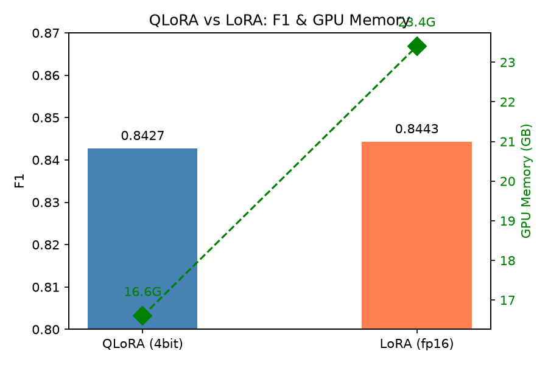
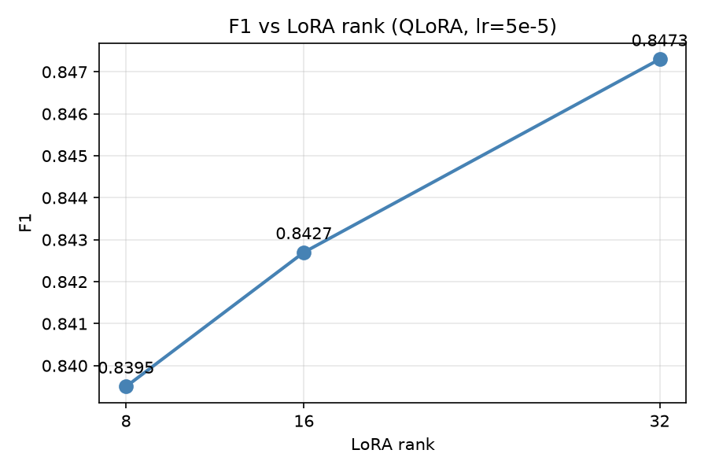
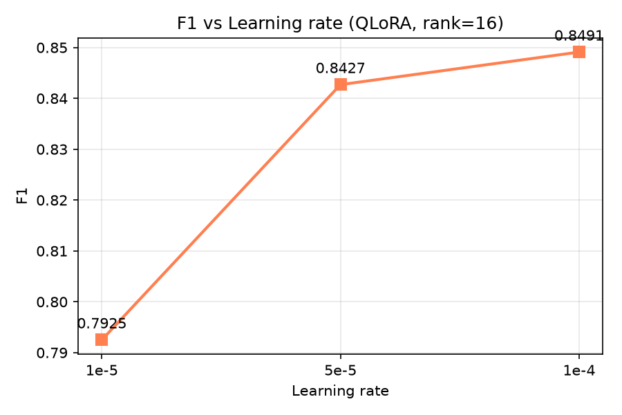
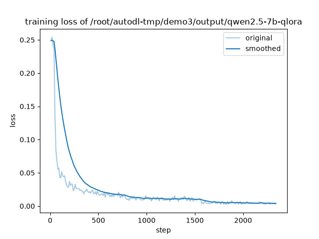

# Demo3: Qwen2.5-7B 指令微调用于生物医学命名实体识别（NER）

基于 Qwen2.5-7B-Instruct，分别使用 **LoRA（BF16）** 与 **QLoRA（4-bit）** 两种微调方案，在 BC2GM 数据集上完成生物医学基因实体（GENE）识别任务，并对比 **LoRA rank**、**学习率**、**量化方式** 对性能与显存的影响。

---

## 目录

- [任务简介](#任务简介)
- [数据集](#数据集)
- [方法](#方法)
- [训练配置](#训练配置)
- [评测方法](#评测方法)
- [方案对比：LoRA vs QLoRA](#方案对比lora-vs-qlora)
- [参数调优实验](#参数调优实验)
- [结论](#结论)
- [快速开始](#快速开始)
- [项目结构](#项目结构)
- [可视化](#可视化)
- [参考](#参考)

---

## 任务简介

- **任务**：生物医学命名实体识别（NER），识别句子中的基因/蛋白实体（GENE）
- **形式**：指令微调，生成式输出，把实体用 `<gene>...</gene>` 包裹
- **基座模型**：Qwen2.5-7B-Instruct
- **微调方案**：LoRA（BF16）+ QLoRA（4-bit bnb）

---

## 完成情况

| 要求 | 当前实现 |
|---|---|
| 数据预处理 | `data/build_dataset.py` 将 BC2GM 转成指令数据 |
| 模型与训练 | Qwen2.5-7B + LoRA/QLoRA，使用 PyTorch 手写训练循环 |
| 模型评估 | 解析 `<gene>` 标签并计算 entity-level P/R/F1 |
| 结果可视化 | 保存 loss 曲线、参数趋势图和结果表 |
| SwanLab | 手写训练循环记录 loss、学习率、验证 loss 和显存峰值 |
| 参数调优 | 对比 rank、学习率和量化方式 |

`src/trainer.py` 直接实现 DataLoader、梯度累积、AdamW、学习率调度、验证与 checkpoint 保存，没有调用 Hugging Face Trainer 或 LLaMA-Factory。`scripts/run_all.py` 使用同一套训练循环依次完成 6 组对比实验。

---

## 数据集

- **来源**：[BC2GM](https://biocreative.bioinformatics.udel.edu/)（BioCreative II Gene Mention）
- **规模**：

| Split | 样本数 |
|-------|--------|
| train | 12,500 |
| dev   | 2,500  |
| test  | 5,000  |

- **格式**：每条样本包含 `instruction` / `input` / `output` 三个字段

```json
{
  "instruction": "You are a biomedical named entity recognition system. Identify all GENE entities in the given sentence and wrap each one with <gene> and </gene> tags. Only output the tagged sentence, nothing else.",
  "input": "Phenotypic analysis demonstrates that trio and Abl cooperate in regulating axon outgrowth in the embryonic central nervous system ( CNS ) .",
  "output": "Phenotypic analysis demonstrates that <gene>trio</gene> and <gene>Abl</gene> cooperate in regulating axon outgrowth in the embryonic central nervous system ( CNS ) ."
}
```

---

## 方法

- **基座**：Qwen2.5-7B-Instruct
- **两种微调方案**：
  - **LoRA（BF16）**：全精度基座 + LoRA 适配器，不量化
  - **QLoRA（4-bit）**：4-bit NF4 量化基座 + LoRA 适配器
- **LoRA 配置**：`rank=16`，`alpha=32`，`dropout=0.05`，目标层为 Q/K/V/O 和 FFN 投影层
- **训练实现**：PyTorch + Transformers + PEFT，自定义训练循环
- **历史实验**：原始结果使用 LLaMA-Factory 完成，单独保存在 `results/legacy/`
- **可视化**：SwanLab

---

## 训练配置

| 项 | LoRA (BF16) | QLoRA (4-bit) |
|---|---|---|
| 基座 | Qwen2.5-7B-Instruct | Qwen2.5-7B-Instruct |
| 量化 | 无 | 4-bit bnb (NF4) |
| lora_rank | 16 | 16 |
| lora_alpha | 32 | 32 |
| lora_dropout | 0.05 | 0.05 |
| lora_target | all | all |
| per_device_train_batch_size | 2 | 4 |
| gradient_accumulation_steps | 8 | 4 |
| 等效 batch size | 16 | 16 |
| learning_rate | 5e-5 | 5e-5 |
| num_train_epochs | 3 | 3 |
| cutoff_len | 1024 | 1024 |
| lr_scheduler_type | cosine | cosine |
| warmup_ratio | 0.1 | 0.1 |
| bf16 | true | true |
| gradient_checkpointing | true | true |
| 硬件 | RTX 5090 32G | RTX 5090 32G |
| 训练时长 | ~70 分钟 | ~50 分钟 |
| 训练显存 | **27.8 GB** | **25.9 GB** |

---

## 评测方法

模型输出为 `<gene>...</gene>` 包裹的句子，评测流程：

1. 用正则 `<gene>(.*?)</gene>` 抽取预测实体 span
2. 统一小写 + strip 归一
3. 与 gold 实体做集合匹配，计算 TP / FP / FN
4. Entity-level 指标：
   - `Precision = TP / (TP + FP)`
   - `Recall = TP / (TP + FN)`
   - `F1 = 2PR / (P + R)`

结果表使用句内唯一实体集合进行统计，`scripts/eval_f1_strict.py` 另外提供按出现次数统计的口径。

---

## 方案对比：LoRA vs QLoRA

下面的数值和图片来自整理代码前已经完成的 LLaMA-Factory 实验，仅作为历史参考。手写训练循环沿用相同的数据、prompt 和主要超参数，但需要重新训练后才能得到对应结果。

在相同基座、相同 LoRA 配置（rank16 / all target）、相同 batch（等效 16）、相同 lr（5e-5）、相同 epoch（3）下，只改变**是否 4-bit 量化**，对比结果：

| 方案 | 量化 | Precision | Recall | F1 | 训练显存 |
|------|------|-----------|--------|-----|----------|
| **LoRA** | BF16 (无) | 0.8468 | 0.8419 | **0.8443** | **27.8 GB** |
| **QLoRA** | 4-bit NF4 | 0.8470 | 0.8386 | **0.8427** | **25.9 GB** |

**对比结论**：

- 本次实验中 QLoRA 比 LoRA 少占用 1.9 GB 显存（约 6.8%）
- 两者 F1 相差 0.0016，QLoRA 的性能损失较小
- 训练时长：LoRA 约 70 分钟，QLoRA 约 50 分钟



### 与参考指标对比

| 配置 | 参考 F1 | 本实验 F1 |
|------|---------|-----------|
| Qwen2.5-7B-LoRA | 84% | **84.43%** |
| Qwen2.5-7B-QLoRA | 83% | **84.27%** |

两种方案的 F1 均达到或略高于参考值。

---

## 参数调优实验

在 QLoRA 方案下，进一步对 **LoRA rank** 和 **学习率** 做参数搜索。

### 实验汇总

| 实验 | 方案 | rank | lr | 量化 | Precision | Recall | F1 | 训练显存 |
|------|------|------|-----|------|-----------|--------|-----|----------|
| qlora_rank16 | QLoRA | 16 | 5e-5 | 4-bit | 0.8470 | 0.8386 | **0.8427** | 25.9G |
| qlora_rank8 | QLoRA | 8 | 5e-5 | 4-bit | 0.8433 | 0.8359 | **0.8395** | 25.9G |
| qlora_rank32 | QLoRA | 32 | 5e-5 | 4-bit | 0.8526 | 0.8421 | **0.8473** | 29.1G |
| qlora_lr1e-5 | QLoRA | 16 | 1e-5 | 4-bit | 0.7950 | 0.7900 | **0.7925** | 25.9G |
| qlora_lr1e-4 | QLoRA | 16 | 1e-4 | 4-bit | 0.8524 | 0.8458 | **0.8491** | 25.9G |
| lora_rank16 | LoRA | 16 | 5e-5 | BF16 | 0.8468 | 0.8419 | **0.8443** | 27.8G |

### 1. LoRA rank 对 F1 的影响（QLoRA）

| rank | F1 |
|------|-----|
| 8 | 0.8395 |
| 16 | 0.8427 |
| 32 | 0.8473 |

**趋势**：在测试的 8、16、32 三个 rank 中，F1 分别为 0.8395、0.8427、0.8473。

**显存趋势**：rank 8 ≈ rank 16（均 25.9G），rank 32 涨到 29.1G。原因是 rank ≤ 16 时显存瓶颈在激活值，rank = 32 时 LoRA 参数与优化器状态开始显著占用显存。



### 2. 学习率对 F1 的影响（QLoRA）

| lr | F1 |
|-----|-----|
| 1e-5 | 0.7925 |
| 5e-5 | 0.8427 |
| 1e-4 | 0.8491 |

**趋势**：F1 随学习率单调上升。lr=1e-5 相比 5e-5 掉 5 个点，说明在固定 3 epoch 下学习率过小会导致严重欠拟合；lr=1e-4 表现最优。

**显存趋势**：三个实验训练显存完全一致（25.9G），证实**学习率不影响显存**。



### 训练 loss 曲线




---

## 结论

1. **LoRA vs QLoRA**：在相同配置下，QLoRA 少占用 1.9G 显存，F1 低 0.0016。

2. **学习率对性能影响最大**：lr=1e-5 相比 5e-5 掉 5.02 个点，在固定 3 epoch 下学习率过小会严重欠拟合；lr=1e-4 表现最优（0.8491）。

3. **LoRA rank 趋势**：rank 从 8 增加到 32 时，F1 从 0.8395 提高到 0.8473。

4. **显存对 rank 非线性**：rank 8 ≈ rank 16（均 25.9G），rank 32 涨到 29.1G。原因是 rank ≤ 16 时显存瓶颈在激活值，rank = 32 时 LoRA 参数与优化器状态开始显著占用显存。

5. **学习率不影响显存**：lr 1e-5 / 5e-5 / 1e-4 三个实验训练显存完全一致（25.9G）。

当前单变量实验中，`rank=32` 和 `learning_rate=1e-4` 分别取得各自组内的最高 F1。两者没有做组合实验，因此不对组合效果作推断。

---

## 快速开始

### 环境

```bash
conda create -n demo3 python=3.11 -y
conda activate demo3
pip install -r requirements.txt
```

### 数据准备

BC2GM 原始数据从官方下载后，运行：

```bash
python data/build_dataset.py --input /path/to/bc2gm --output data/
```

生成 `data/bc2gm_train.json` / `data/bc2gm_dev.json` / `data/bc2gm_test.json`。

### 训练

```bash
# 手写 PyTorch 训练循环，默认运行 QLoRA
python scripts/train.py --config qlora.json

# LoRA
python scripts/train.py --config lora.json
```

### 推理 + 评测

```bash
# 1. 单句预测
python scripts/predict.py --config predict_custom.json \
  --text "Phenotypic analysis demonstrates that trio and Abl cooperate."

# 2. 对 test 集生成预测
python scripts/predict.py --config predict_custom.json \
  --input data/bc2gm_test.json \
  --output results/custom_predictions.jsonl

# 3. 计算 entity-level F1
python scripts/evaluate.py \
  --pred results/custom_predictions.jsonl \
  --gold data/bc2gm_test.json
```

### 批量参数实验

下面的命令会使用手写训练循环依次训练 6 组实验，并重新生成预测、指标 CSV 和趋势图：

```bash
# 建议先只跑 baseline，确认显存和流程
python scripts/run_all.py --experiments baseline

# baseline 正常后再跑其余 5 组
python scripts/run_all.py --experiments rank8 rank32 lr1e5 lr1e4 lora

# 也可以一次运行全部实验
python scripts/run_all.py
```

运行时间较长。脚本会跑 QLoRA baseline、rank 8、rank 32、lr 1e-5、lr 1e-4 和 LoRA，结果写入 `results/results.csv`。

---

## 项目结构

```
demo3/
├── README.md
├── requirements.txt
├── configs/
│   ├── lora.json               # 手写 LoRA 训练配置
│   ├── qlora.json              # 手写 QLoRA 训练配置
│   └── predict_custom.json     # 手写推理配置
├── data/
│   ├── build_dataset.py
│   └── bc2gm_{train,dev,test}.json  # 不提交到 Git
├── src/
│   ├── config.py
│   ├── dataset.py
│   ├── metrics.py
│   ├── model.py
│   ├── trainer.py
│   ├── predict.py
│   └── visualization.py
├── scripts/
│   ├── train.py
│   ├── evaluate.py
│   ├── predict.py
│   ├── eval_f1_strict.py
│   ├── run_all.py
│   └── plot.py
└── results/
    └── legacy/                 # 原 LLaMA-Factory 实验结果
```

---

## 可视化

SwanLab 项目：[qwen2.5-ner](https://swanlab.cn/@Lyx1/qwen2.5-ner)

包含 6 个 run：

- `bc2gm-qlora`（QLoRA baseline, rank16, lr5e-5）
- `exp_rank8`（QLoRA rank8）
- `exp_rank32`（QLoRA rank32）
- `exp_lr1e5`（QLoRA lr1e-5）
- `exp_lr1e4`（QLoRA lr1e-4）
- `exp_lora`（LoRA BF16）

---

## 参考

- [LLaMA-Factory](https://github.com/hiyouga/LLaMA-Factory)
- [03Qwen2.5-7B-BC2GM_NER](https://github.com/rice-cpu/03Qwen2.5-7B-BC2GM_NER)
- [Demo-3](https://github.com/Username2078/Demo-3)
- [BC2GM Dataset](https://biocreative.bioinformatics.udel.edu/)
- [Qwen2.5](https://github.com/QwenLM/Qwen2.5)
- [SwanLab](https://swanlab.cn/)
